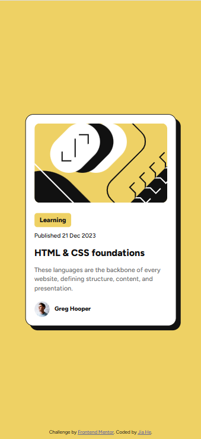
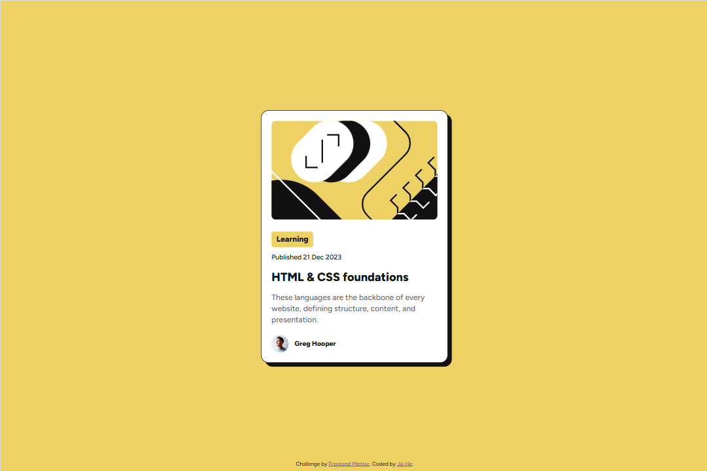

# Frontend Mentor - Blog preview card solution

This is my solution to the [Blog preview card challenge on Frontend Mentor](https://www.frontendmentor.io/challenges/blog-preview-card-ckPaj01IcS). Frontend Mentor challenges help you improve your coding skills by building realistic projects.

## Table of contents

- [Overview](#overview)
  - [The challenge](#the-challenge)
  - [Screenshot](#screenshot)
  - [Links](#links)
- [My process](#my-process)
  - [Built with](#built-with)
  - [What I learned](#what-i-learned)
  - [Continued development](#continued-development)
  - [Useful resources](#useful-resources)
- [Author](#author)

## Overview

### The Challenge

Users should be able to:

- View the optimal layout for the component depending on their device's screen size

- See hover and focus states for all interactive elements

### Screenshot

#### 📱 Mobile



#### 💻 Desktop



### Links

- Solution URL: [My Github repo](https://github.com/JiaHe35354/blog-preview-card)
- Live Site URL: [https://blog-preview-card-jiah.netlify.app/](https://blog-preview-card-jiah.netlify.app/)

## My process

### Built with

- Semantic HTML5 markup
- CSS custom properties
- Flexbox
- Desktop-first workflow
- Responsive design with media queries

### What I learned

During this project, I practiced:

- Using :root CSS variables for color theming

- Applying Flexbox for centering component and for layout and spacing between avatar and caption

- Managing responsive font sizes and layouts using em units in media queries

Here's an example of centering a component with Flexbox I used:

```css
body {
  display: flex;
  justify-content: center;
  align-items: center;
}
```

Here's an example of a responsive media query I used:

```css
@media (max-width: 28.75em) {
  html {
    font-size: 50%;
  }
}
```

### Continued development

In future projects, I want to:

- Add focus-visible states for better usability

- Learn more about scalable design systems with reusable components

### Useful resources

- [CSS Flexbox](https://developer.mozilla.org/en-US/docs/Learn_web_development/Core/CSS_layout/Flexbox) - This helped me for centering a component. I really liked this pattern and will use it going forward.
- [MDN: Using media queries](https://developer.mozilla.org/en-US/docs/Web/CSS/CSS_media_queries/Using_media_queries) - This is an amazing article which helped me finally understand media queries. I'd recommend it to anyone still learning this concept.

## Author

- Frontend Mentor - [@JiaHe35354](https://www.frontendmentor.io/profile/JiaHe35354)
